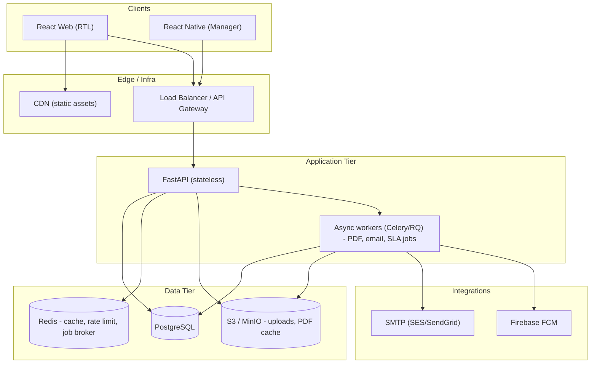
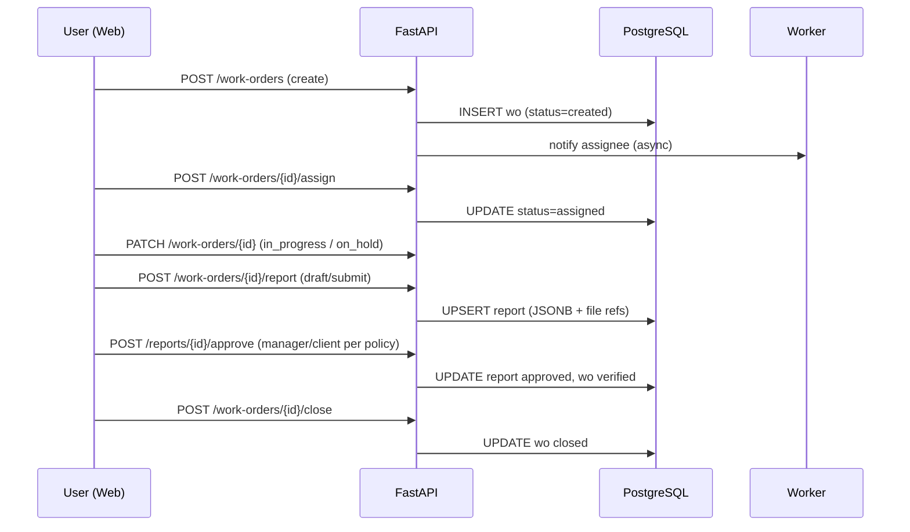
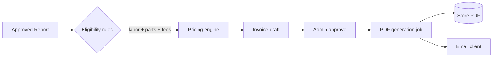
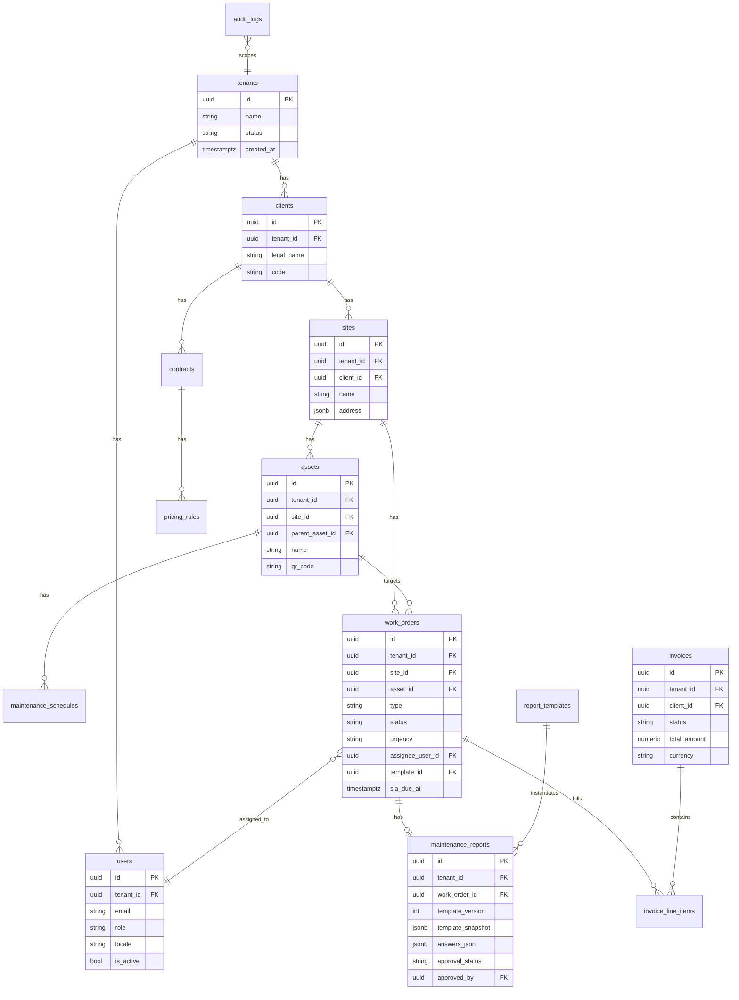

# NexTask FMS — System Architecture & Technical Design

This document captures the high-level architecture, data model, API shape, and cross-cutting concerns for the Facility Management System (FMS). It aligns with the Version 2.0 refined scope (multi-tenant SaaS, API-first, Arabic UI, English API/DB).

---

## 1. Executive Summary

NexTask FMS is an API-first, multi-tenant SaaS for facility maintenance: preventive and corrective work, asset-centric operations, template-driven field reports, and billing tied to approved work. A single **FastAPI** backend serves **React (web)** and later **React Native (mobile)** over a unified **REST** surface, with **PostgreSQL** (JSONB for templates), **S3-compatible** object storage for files (target), **SMTP** and **FCM** for notifications (target), and **WeasyPrint** or **ReportLab** for branded PDFs (implementation may use ReportLab for portability). **Row-level tenancy** via `tenant_id` (and optional PostgreSQL RLS) enforces isolation. The **web UI** is **Arabic-primary with English toggle** and full **RTL** support; **API and database remain English-only**. MVP delivers maintenance, templates, report submission/approval, basic invoicing from report data, RBAC for six roles, audit trails, and PDFs for reports and invoices—without offline-first complexity.

---

## 2. System Architecture

### 2.1 Architecture Diagram



### 2.2 Component Breakdown

| Component | Responsibility |
|-----------|----------------|
| **React Web** | Full CRUD for admin/client/site/technician flows; template builder; work orders; report filling; invoices; dashboards; i18n (ar/en). |
| **React Native** | Manager-only: approval queue, notifications, lightweight WO visibility (Phase 3). |
| **FastAPI** | Auth (JWT + refresh), RBAC, tenancy resolution, REST resources, validation, presigned upload URLs (target), idempotent invoice triggers. |
| **Workers** | PDF render (report/invoice), email dispatch, SLA timers/escalation, scheduled preventive WO generation. |
| **PostgreSQL** | Relational core + JSONB template definitions and filled report payloads; optional RLS policies on `tenant_id`. |
| **Redis** | Sessions optional; rate limiting; job queue backend. |
| **Object storage** | Photos, signatures, generated PDFs (versioned paths). |
| **SMTP / FCM** | Transactional email and push per notification matrix. |

### 2.3 Key Data Flows

**Work order lifecycle**



**Report → invoice flow**



---

## 3. Database Design

### 3.1 Multi-Tenancy Approach

- **Model:** Shared schema, **every tenant-scoped row carries `tenant_id` (UUID)** referencing `tenants`.
- **Enforcement:**
  - **Application layer:** All queries filter by `tenant_id` from JWT claims (never from client-supplied body for scope).
  - **Database layer (recommended):** PostgreSQL **RLS** policies: `USING (tenant_id = current_setting('app.tenant_id')::uuid)` set per request via connection/session GUC from API middleware.
- **Super admin:** Separate mechanism (e.g., `is_platform_admin` claim) bypasses tenant filter only on designated platform tables; never mix tenant data in one query.

### 3.2 ERD Diagram



### 3.3 Core Tables (conceptual)

**Platform / tenancy:** `tenants`, `users`, `user_site_scopes`

**CRM / sites:** `clients`, `sites`, `assets`

**Maintenance:** `maintenance_schedules`, `work_orders`, `work_order_events` (recommended append-only)

**Templates & reports:** `report_templates`, `maintenance_reports`

**Billing:** `contracts`, `pricing_profiles`, `pricing_rules` (or merged profiles), `parts_catalog`, `invoices`, `invoice_line_items`

**Notifications & SLA:** `notification_preferences`, `notification_outbox`, `sla_policies`, `sla_events`

**Audit:** `audit_logs`

**Indexes:** `(tenant_id, ...)` on all scoped tables; partial indexes on hot filters (e.g. `work_orders(status)`); GIN on `answers_json` only if query patterns require it.

### 3.4 Template Storage Schema (JSONB)

Stored in `report_templates.schema_json` (versioned). Filled data in `maintenance_reports.answers_json` keyed by stable `field.id`.

- **Template document:** `template_ref` (internal id), `name`, `version`, `sections[]` each with `id`, `title_key` (i18n key for UI), `fields[]`.
- **Field types:** `checklist`, `text`, `textarea`, `number`, `measurement`, `photo`, `signature`, `parts_used`, `labor_log`, `header` (computed, read-only in UI).
- **Validation:** `required`, `min`/`max`, `max_photos`, `allowed_mime`, `unit`, `options` for checklists.

**Example (API may expose as `schema_json`):**

```json
{
  "template_id": "tpl_hvac_inspection",
  "name": "HVAC Inspection Checklist",
  "version": 2,
  "sections": [
    {
      "id": "sec_1",
      "title": "Visual Inspection",
      "fields": [
        {
          "id": "fld_1",
          "type": "checklist",
          "label": "Filters clean",
          "options": ["Pass", "Fail", "N/A"],
          "required": true
        },
        {
          "id": "fld_2",
          "type": "photo",
          "label": "Filter condition photo",
          "max_photos": 2,
          "required": false
        }
      ]
    },
    {
      "id": "sec_2",
      "title": "Measurements",
      "fields": [
        {
          "id": "fld_3",
          "type": "number",
          "label": "Supply air temperature",
          "unit": "°C",
          "min": 10,
          "max": 35,
          "required": true
        }
      ]
    }
  ]
}
```

---

## 4. API Specification

**Conventions:** `/api/v1/...`; JSON; English keys; errors: `{ "error": { "code": "...", "message": "...", "details": {} } }` (style may vary by implementation).

### 4.1 Authentication

| Endpoint | Method | Description |
|----------|--------|-------------|
| `/api/v1/auth/login` | POST | Email + password → `access_token`, `refresh_token`, `expires_in`, user profile + `tenant_id`, `roles` |
| `/api/v1/auth/refresh` | POST | `refresh_token` → new pair (rotation optional) |
| `/api/v1/auth/logout` | POST | Invalidate refresh token (server-side denylist in Redis) — or client-discard tokens |
| `/api/v1/users/me` | GET | Current user + permissions summary |

**Flow:** Short-lived JWT (access) with claims: `sub`, `tenant_id`, `role`, `scopes`, `site_ids` (if applicable). Refresh stored hashed in DB or Redis rotation.

### 4.2 Endpoints by Module (summary)

**Tenancy / admin:** `GET/POST /tenants`, `PATCH /tenants/{id}` (super admin)

**Users & RBAC:** `GET/POST /users`, `PATCH /users/{id}`, `POST /users/{id}/deactivate`, `GET /roles` (metadata)

**Clients, sites, assets:** `GET/POST/PATCH /clients`, `/sites`, `/assets`; `GET /assets/{id}/qr`

**Templates:** `GET/POST /report-templates`, `GET/PATCH /report-templates/{id}`, `POST /report-templates/{id}/publish`

**Work orders:** `GET /work-orders`, `POST /work-orders`, `GET/PATCH /work-orders/{id}`, `POST /work-orders/{id}/assign`, transitions via `PATCH` or dedicated actions

**Reports:** `GET/PUT /work-orders/{id}/report`, `POST /work-orders/{id}/report/submit`, `POST /reports/{id}/approve`, `POST /reports/{id}/reject`, `GET /reports/{id}/pdf`

**Files:** `POST /uploads/presign`, `POST /uploads/complete` (target)

**Billing:** `POST /work-orders/{id}/generate-invoice`, `GET/PATCH /invoices`, `POST /invoices/{id}/approve`, `send`, `void`, `GET /invoices/{id}/pdf`

**Contracts & pricing:** `GET/POST /contracts`, `GET/POST /pricing-profiles`, `GET/POST /pricing-rules`

### 4.3 Pagination / Filtering

- Query: `page`, `page_size` (capped), `sort=-created_at`, filters as `status=in_progress,assigned`.
- Response envelope example:

```json
{
  "data": [],
  "meta": { "page": 1, "page_size": 20, "total": 134 }
}
```

---

## 5. Template & Report System

### 5.1 Template Schema Design

- **Authoring:** Admin builds sections/fields in UI; backend stores `schema_json` and bumps `version` on publish.
- **Snapshot:** On first save of a report for a WO, persist `template_snapshot_json` so historical PDFs remain stable if the template changes later.
- **answers_json:** Map `field_id` → primitive or structured value (e.g., labor: `[{ "start", "end", "user_id" }]`).

### 5.2 Report Filling Flow

1. WO moves to **assigned** / **in_progress** with linked `template_id`.
2. Technician opens report editor; **PUT** draft answers (throttled autosave to server — **online** per product constraints).
3. **Submit** runs server validation (required fields, measurement bounds).
4. Manager or Client Admin **approves** per tenant policy.
5. WO can move to **verified** / **closed**; invoice eligibility gated on `report.status === approved` (and WO rules).

### 5.3 PDF Generation Pipeline

1. **Trigger:** Approve report or approve invoice; enqueue job with `report_id` / `invoice_id`.
2. **Render:** HTML template + CSS (RTL-aware for bilingual PDFs) **or** ReportLab/weasyprint pipeline.
3. **PDF:** Preferred stack per environment (**WeasyPrint** for HTML/CSS fidelity; **ReportLab** where native deps are difficult).
4. **Store:** Versioned paths under tenant/report or tenant/invoice.
5. **Deliver:** Email via worker with attachment or secure link.

---

## 6. Billing System

### 6.1 Pricing Configuration

- **No hardcoded prices:** Rules from `pricing_profiles` + rules keyed by `maintenance_type`, `urgency`, `contract`, `site`, or `asset category`.
- **Rule types:** hourly rate tables, **parts markup %**, **flat service fee** per WO type, **surcharges** (emergency %, travel flat).
- **Precedence:** Contract-specific overrides tenant defaults; most specific rule wins (`sort_order` or explicit priority).

### 6.2 Report-to-Invoice Flow

1. WO **verified** / **closed** (per policy) and report **approved**.
2. **Extractor** reads structured sections: `labor_log`, `parts_used`, and fee triggers from template metadata.
3. **Engine** applies pricing rules; rounds to 2 decimals; currency **SAR** (MVP).
4. Creates **draft** `invoice` + `invoice_line_items` with `source_ref` to report field paths for audit.
5. MVP option: **one WO → one invoice**; Phase 2: batch multiple WOs.

### 6.3 Invoice Lifecycle

`draft` → `approved` (finance) → `sent` (email + PDF) → `paid` | `overdue` (cron) → `void` (correction). **Audit:** State transitions logged; amounts immutable after `sent` (credit note for changes).

---

## 7. UI/UX Guidelines

### 7.1 Design Tokens

| Token | Recommendation |
|-------|----------------|
| **Colors** | Neutral slate background, primary teal (`#0f766e` / brand from tenant settings), semantic success/warning/danger |
| **Typography** | **Noto Sans Arabic** + **Inter** for Latin; readable scale for RTL |
| **Spacing** | 4px base grid; consistent form spacing |
| **Components** | Tailwind + shadcn/ui patterns |

### 7.2 Key Screens (conceptual)

**Web — Company Admin:** Dashboard, clients/sites, users, template builder, pricing/contracts.

**Web — Technician:** My work, WO detail, mobile-friendly report form, photos/signatures.

**Web — Client Admin:** Requests, approve reports, invoices, SLA summary.

**Web — Site Manager:** Site assets, corrective requests, site-scoped WO board.

**Mobile — Manager:** Approvals, notifications, optional map (Phase 3).

### 7.3 RTL Implementation Notes

- Root `dir="rtl"` when `locale === 'ar'`; `lang` attribute set.
- **Tailwind:** logical properties (`ms-`, `me-`, `ps-`, `pe-`).
- **PDF:** Separate RTL stylesheet or `dir=rtl` on container for Arabic reports.

---

## 8. Implementation Roadmap

### 8.1 Phase 1: MVP (8–10 weeks)

Tenancy, users, RBAC, clients/sites/assets, work orders (lifecycle), simple preventive schedules, SLA fields + basic warnings, template CRUD + report flow + approval, PDF reports, object storage, audit, basic billing + invoice PDF, email subset, Arabic-primary web + i18n.

### 8.2 Phase 2: Full Features (6–8 weeks)

Client portal polish, batch invoicing, contract renewals, richer SLA escalation, notification center UI, parts/inventory, analytics/export.

### 8.3 Phase 3: Mobile + Analytics (6–8 weeks)

React Native manager app (FCM), map view, advanced analytics.

---

## 9. Risks & Mitigations

| Risk | Impact | Mitigation |
|------|--------|------------|
| PDF perf/memory on photo-heavy reports | High | Async workers, image downscale before embed, cap photos per field |
| Tenant isolation bug | Critical | RLS + integration tests + security review; deny-by-default queries |
| Pricing rule complexity | Medium | Ordered rule list + UI tests; versioning on profiles |
| RTL/layout regressions | Medium | Visual regression tests, logical CSS |
| SLA job drift | Medium | Idempotent schedulers, DLQ, alerts on backlog |

---

## 10. Open Questions

1. **Approval authority:** Client admin for all reports vs. threshold-based?
2. **Tax/VAT:** Saudi VAT rate, invoice fields, ZATCA e-invoicing timeline?
3. **Multi-WO invoices:** MVP or Phase 2?
4. **Technician assignment:** Single assignee vs. team split labor?
5. **Asset QR:** Unique per tenant vs. per site?
6. **Manager mobile scope:** Approvals + notifications only in Phase 3?

---

## Verification Checklist

- [x] API-first; multi-tenant isolation; Arabic RTL UI; English API/DB
- [x] Template system supports dynamic fields (JSONB)
- [x] Report-to-invoice path documented
- [x] RBAC covers Super Admin, Company Admin, Client Admin, Site Manager, Technician, Manager
- [x] PDF generation approach defined
- [x] Mobile scope limited to manager workflows in later phase

---

*This file is the architecture reference. Concrete routes and models may evolve in `backend/app` and the web client; treat the repository as the source of truth for exact endpoint paths and payloads.*
