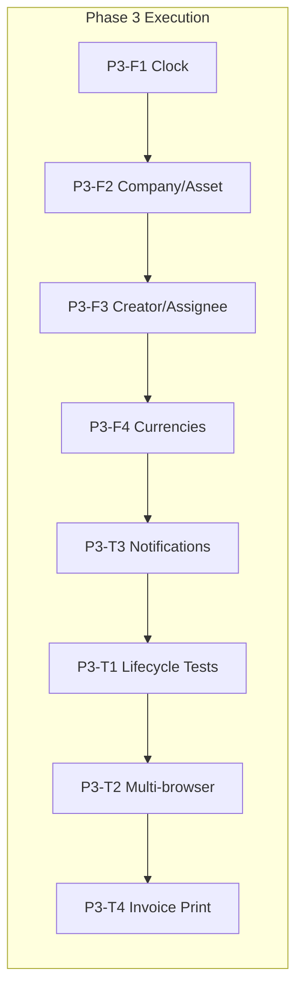

# FMS Phase 3 Sprint Plan

**Date:** April 18, 2026  
**Status:** 🟡 Ready to Start  
**Version:** 3.0

---

## Executive Summary

Phase 3 completes the core FMS functionality by implementing missing company creation and asset registration features, adding real-time notifications (WebSocket + Email), enhancing work order tracking, and supporting multi-currency invoices (EGP, SAR, USD, EUR). This phase focuses on completing the Super User workflow lifecycle and comprehensive user testing across all 6 roles.

---

## Sprint Goal

Complete the Super User workflow lifecycle by implementing missing company creation and asset registration features, adding real-time notifications, enhancing work order tracking, and supporting multi-currency invoices (EGP, SAR, USD, EUR).

---

## Phase 3 Features Summary

| ID | Feature | Priority | Effort | Status |
|----|---------|----------|--------|--------|
| P3-F1 | Clock/Date in Header | Low | S | Pending |
| P3-F2 | Create Company + Register Asset UI/Backend | High | L | Pending |
| P3-F3 | Work Order Creator/Assignee Display | Medium | S | Pending |
| P3-F4 | Multi-Currency Invoices (EGP, SAR, USD, EUR) | Medium | M | Pending |

## Phase 3 Testing Tasks

| ID | Test Scenario | Priority | Status |
|----|---------------|----------|--------|
| P3-T1 | Full User Lifecycle Testing (all 6 roles) | Critical | Pending |
| P3-T2 | Multi-browser Notification Testing | High | Pending |
| P3-T3 | Real-time Notifications (WebSocket + Email) | High | Pending |
| P3-T4 | Invoice Print Layout Verification | Medium | Pending |

---

## Detailed Feature Specifications

### P3-F1: Clock/Date Display in Header

**Goal:** Display current date/time in the top header to assist users when creating work orders and registering assets.

**Implementation:**
- Add `ClockWidget` component in `src/components/ClockWidget.tsx`
- Integrate into `src/components/Layout.tsx` header
- Support Arabic/English date formatting with Hijri calendar option
- Use `Intl.DateTimeFormat` for locale-aware formatting

**Acceptance Criteria:**
- ✅ Clock displays in header, updates every minute
- ✅ Respects i18n locale (AR/EN)
- ✅ Shows current server time (not just local time)

---

### P3-F2: Create Company + Register Asset (UI/Backend)

**Goal:** Enable super_admin/company_admin to create new companies (clients) and register new assets through the UI.

**Backend Tasks:**
- Verify `backend/app/api/routes/clients.py` has `POST /clients` endpoint
- Add `POST /assets` endpoint in `backend/app/api/routes/assets.py` if missing
- Ensure tenant_id, site_id validation on asset creation
- Add lifecycle fields on creation (max_repair_count, max_age_years, installed_on)

**Frontend Tasks:**
- Add "Create Company" modal/page in `src/pages/CompaniesPage.tsx`
- Add "Register Asset" form in `src/pages/AssetsPage.tsx`
- Auto-populate site_id when navigating from site context
- Include asset lifecycle fields (category, model, serial, warranty, installed_on)

**UI/UX Tasks:**
- Design company creation form (name, contact, address, logo upload placeholder)
- Design asset registration form with lifecycle fields
- Add validation feedback, loading states, success toast

**Acceptance Criteria:**
- ✅ Super Admin can create a new company from Companies page
- ✅ Company Admin can register assets within their tenant
- ✅ Asset registration includes lifecycle tracking fields
- ✅ Forms validate required fields with clear error messages

---

### P3-F3: Work Order Creator/Assignee Display

**Goal:** Clearly display who created a work order and who is assigned (technician/company engineer).

**Implementation:**
- Add `creator` and `assignee` user info to work order detail response
- Display creator name/avatar in `src/pages/WorkOrderDetailPage.tsx`
- Show assignee prominently with role badge (Technician/Engineer)
- Add to work order list view as columns

**Backend:**
- Modify `GET /work-orders/{id}` to include creator and assignee user objects
- Use SQLAlchemy relationships: `WorkOrder.created_by_user`, `WorkOrder.assignee`

**Acceptance Criteria:**
- ✅ Work order detail shows "Created by: [Name] on [Date]"
- ✅ Work order detail shows "Assigned to: [Name] ([Role])"
- ✅ List view has creator/assignee columns (optional, filterable)

---

### P3-F4: Multi-Currency Invoices

**Goal:** Support EGP, SAR, USD, EUR currencies in invoices.

**Backend:**
- Add `currency` enum to Invoice model (default: SAR)
- Update `backend/app/schemas.py` with currency field
- Update invoice creation/update endpoints to accept currency
- Store exchange rates reference (optional: manual entry per invoice)

**Frontend:**
- Add currency selector dropdown in invoice forms
- Display currency symbol correctly (EGP £, SAR ﷼, USD $, EUR €)
- Update invoice print layout for currency display

**Acceptance Criteria:**
- ✅ Invoice can be created with any of 4 currencies
- ✅ Currency displays correctly in list, detail, and print views
- ✅ Existing invoices default to SAR

---

## Notification System (P3-T3)

**Goal:** Real-time notifications when work orders are created or status updated.

**Backend (WebSocket):**
- Add WebSocket endpoint in `backend/app/api/routes/notifications.py`
- Broadcast events: `work_order.created`, `work_order.status_changed`
- Filter by user scope (only relevant notifications per role/tenant)

**Backend (Email):**
- Add email notification service in `backend/app/services/email.py`
- Configure SMTP/SendGrid for production
- Email templates for: new WO assigned, WO status change, WO completed

**Frontend:**
- Add `NotificationProvider` context in `src/contexts/NotificationContext.tsx`
- Display toast notifications for real-time events
- Add notification bell icon in header with unread count
- Notification dropdown with recent items

**Acceptance Criteria:**
- ✅ User A creates work order, User B (assignee) receives real-time notification
- ✅ Status change triggers notification to relevant parties
- ✅ Email sent to assignee when work order assigned
- ✅ Notifications work across multiple browser tabs/windows

---

## Testing Plan (P3-T1, T2, T4)

### P3-T1: Full User Lifecycle Testing

Test each role's complete workflow:

| Role | Workflow |
|------|----------|
| Super Admin | Login → Create Company → Create Site → Create WO → Assign → Complete → Invoice → Close |
| Company Admin | Login → View Companies → Sites → WOs → Reports → Invoices |
| Client Admin | Login → View Sites → Create WO → Track Status → View Invoice |
| Site Manager | Login → View Site WOs → Manage Assets → Reports |
| Technician | Login → View Assigned WOs → Update Status → Submit Report |
| Manager | Login → Approve Reports → View Labor → Generate Invoice |

### P3-T2: Multi-Browser Notification Testing

- Open 2 browser windows (different users)
- User A creates work order assigned to User B
- Verify User B receives real-time notification
- Test status change notifications
- Test across different roles

### P3-T4: Invoice Print Layout

- Verify header (company logo, address, invoice #)
- Verify line items render correctly
- Verify currency symbol displays properly (EGP, SAR, USD, EUR)
- Verify total calculations
- Test print in Chrome, Firefox, Edge

---

## Agent Task Distribution

### Backend Agent Tasks

```
P3-F2-BE: Asset registration endpoint
P3-F3-BE: Work order creator/assignee response enhancement
P3-F4-BE: Multi-currency invoice support
P3-T3-BE: WebSocket notification endpoint
P3-T3-BE: Email notification service
```

### Frontend Agent Tasks

```
P3-F1-FE: ClockWidget component
P3-F2-FE: Company creation form
P3-F2-FE: Asset registration form
P3-F3-FE: Creator/Assignee display in WO detail
P3-F4-FE: Currency selector in invoices
P3-T3-FE: NotificationProvider + toast UI
P3-T3-FE: Notification bell dropdown
```

### UI/UX Agent Tasks

```
P3-F2-UX: Company creation form wireframe
P3-F2-UX: Asset registration form wireframe
P3-T3-UX: Notification bell + dropdown design
P3-T4-UX: Invoice print layout refinement
```

### QA Agent Tasks

```
P3-T1: User lifecycle test scenarios (6 roles)
P3-T2: Multi-browser notification test plan
P3-T3: Notification delivery verification
P3-T4: Invoice print layout test checklist
```

### PM Agent Tasks

```
Coordinate sprint execution
Track progress across agents
Review deliverables
Risk identification
```

---

## Execution Sequence



---

## Files to Create/Modify

**New Files:**
- `docs/phase3/PHASE3_PLAN.md` - This plan
- `docs/phase3/prompt_backend.md` - Backend agent prompt
- `docs/phase3/prompt_frontend.md` - Frontend agent prompt
- `docs/phase3/prompt_uiux.md` - UI/UX agent prompt
- `docs/phase3/prompt_qa.md` - QA agent prompt
- `docs/phase3/prompt_pm.md` - PM agent prompt
- `src/components/ClockWidget.tsx` - Clock component
- `src/contexts/NotificationContext.tsx` - Notification state
- `backend/app/services/email.py` - Email service
- `backend/app/api/routes/notifications.py` - WebSocket endpoint

**Files to Modify:**
- `src/components/Layout.tsx` - Add clock, notification bell
- `src/pages/CompaniesPage.tsx` - Add create company
- `src/pages/AssetsPage.tsx` - Add register asset
- `src/pages/WorkOrderDetailPage.tsx` - Show creator/assignee
- `backend/app/models.py` - Invoice currency enum
- `backend/app/schemas.py` - Currency field
- `backend/app/api/routes/invoices.py` - Currency support

---

## Risk Assessment

| Risk | Impact | Mitigation |
|------|--------|------------|
| WebSocket complexity | High | Start with polling fallback |
| Email deliverability | Medium | Use SendGrid for reliability |
| Multi-currency display | Low | Use Intl.NumberFormat |
| Testing time | Medium | Prioritize P3-T1 lifecycle tests |

---

## Success Metrics

- ✅ All 4 features implemented and tested
- ✅ Super User can complete full lifecycle (create company → create WO → close)
- ✅ Notifications delivered within 2 seconds
- ✅ Invoice prints correctly in all 4 currencies
- ✅ Zero RBAC/tenant isolation regressions

---

## Documentation Index

- **[PHASE3_PLAN.md](PHASE3_PLAN.md)** - This file (overview)
- **[prompt_backend.md](prompt_backend.md)** - Backend agent instructions
- **[prompt_frontend.md](prompt_frontend.md)** - Frontend agent instructions
- **[prompt_uiux.md](prompt_uiux.md)** - UI/UX agent instructions
- **[prompt_qa.md](prompt_qa.md)** - QA agent instructions
- **[prompt_pm.md](prompt_pm.md)** - PM agent instructions

---

**Phase 3 Status:** 🟡 **READY TO START**  
**Last Updated:** April 18, 2026  
**Expected Completion:** Flexible - prioritize quality over speed
