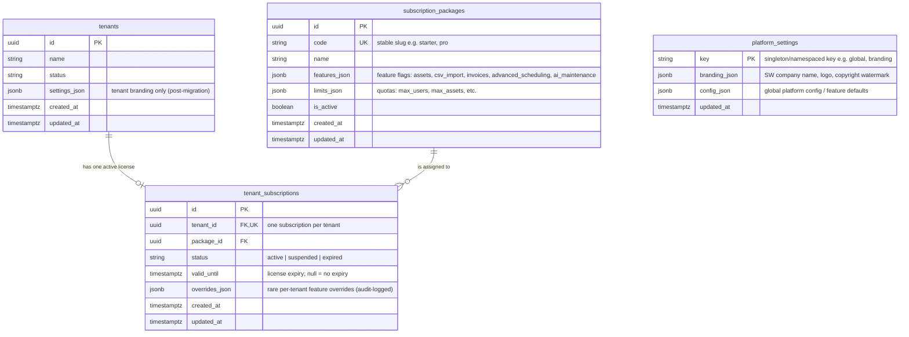

# ERD — Wave 0 Platform & Subscription Schema

**Ticket:** NT-101 (AgDR sign-off + ERD for packages & tenant_subscriptions)
**Epic:** Phase 3 Multi-Tenant Restructure
**AgDR:** [AgDR-PHASE3-TENANT-ARCHITECTURE.md](AgDR-PHASE3-TENANT-ARCHITECTURE.md) §3 (Subscription & feature flags), §5 (Invoice data contract / branding)
**Status:** Approved for Build (Wave 0 — 2026-06-06)
**Author:** Tariq (Solution Architect)

---

## Scope

This ERD covers the **three new platform-owned tables** introduced in Wave 0 and their
relationship to the existing `tenants` table. These tables are the foundation for:

- SW-controlled subscription packages and feature flags (NT-105, NT-108)
- Per-tenant license assignment and freeze enforcement (NT-106, NT-107)
- Platform-level branding/config consumed by invoice PDFs (NT-125) and global settings

Tables `subscription_packages` and `platform_settings` are **global / platform-scoped**
(no `tenant_id`). `tenant_subscriptions` is the join that binds a tenant to exactly one
active package.

---

## Mermaid ERD

---

## Table definitions

### `subscription_packages` (platform-owned)

The SW company's catalog of sellable packages. Single source of truth for feature flags.

| Column | Type | Constraints | Notes |
|--------|------|-------------|-------|
| `id` | uuid | PK | |
| `code` | string | UNIQUE, not null | Stable machine slug (`starter`, `pro`, `enterprise`) |
| `name` | string | not null | Human display name |
| `features_json` | jsonb | not null, default `{}` | Boolean feature map: `assets`, `csv_import`, `invoices`, `advanced_scheduling`, `ai_maintenance` (placeholder) |
| `limits_json` | jsonb | not null, default `{}` | Quotas: `max_users`, `max_assets`, etc. |
| `is_active` | boolean | not null, default `true` | Soft-disable a package without deleting history |

### `tenant_subscriptions` (the license link)

Binds one tenant to one package. Enforces "complete freeze" via `status` + `valid_until`.

| Column | Type | Constraints | Notes |
|--------|------|-------------|-------|
| `id` | uuid | PK | |
| `tenant_id` | uuid | FK → `tenants.id`, **UNIQUE**, not null | One active subscription per tenant |
| `package_id` | uuid | FK → `subscription_packages.id`, not null | Assigned by SW staff only |
| `status` | string | not null, default `active` | `active` / `suspended` / `expired` |
| `valid_until` | timestamptz | nullable | License expiry; `null` = perpetual |
| `overrides_json` | jsonb | not null, default `{}` | Rare per-tenant flag overrides; audit-logged per AgDR §Risks |

**Unique constraint** on `tenant_id` guarantees the one-license-per-tenant invariant
(AgDR §3). License resolution per request is cached for the p95 < 5ms NFR.

### `platform_settings` (global singleton-style)

Platform-wide branding and config. Keyed (not tenant-scoped) so SW branding is global.

| Column | Type | Constraints | Notes |
|--------|------|-------------|-------|
| `key` | string | PK | Namespaced key (e.g. `global`, `branding`) |
| `branding_json` | jsonb | not null, default `{}` | SW company legal name, logo, invoice copyright watermark (AgDR §5) |
| `config_json` | jsonb | not null, default `{}` | Global config / default feature toggles |

---

## Relationships

- **`tenants` 1 ──◁ 0..1 `tenant_subscriptions`** — a tenant has at most one
  subscription row (enforced by the UNIQUE constraint on `tenant_id`). A newly created
  tenant may briefly have none until SW staff assigns a package.
- **`subscription_packages` 1 ──< 0..* `tenant_subscriptions`** — one package is
  assigned to many tenants; a package with active subscribers cannot be hard-deleted
  (use `is_active = false`).
- **`platform_settings`** has no FK to tenant tables by design — it is platform-global.

---

## Migration notes (feeds NT-102 / NT-103)

- NT-102 creates these three tables.
- NT-103 migrates each tenant's existing `Tenant.settings_json.subscription` into a
  `tenant_subscriptions` row linked to a default package; `settings_json` is then
  reserved for **tenant branding only** (AgDR §7). Dual-read window for one release.
- Seed a default `platform_settings` row (`key = 'global'`) with SW branding.

---

## Traceability

| Requirement | Covered by |
|-------------|-----------|
| SUB-01 (SW defines packages) | `subscription_packages` |
| SUB-02 (assign package + expiry) | `tenant_subscriptions.package_id`, `.valid_until` |
| SUB-03 (per-feature enable/disable) | `features_json` + `overrides_json` |
| SUB-04 (complete freeze) | `tenant_subscriptions.status`, `.valid_until` |
| SUB-06 (migrate 3.1 subscription) | NT-103 migration (this ERD's target schema) |
| INV-05 (SW copyright watermark) | `platform_settings.branding_json` |
